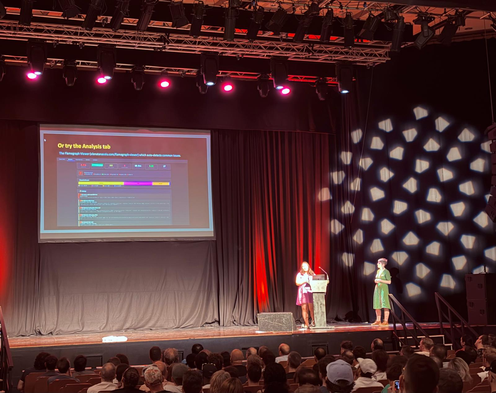

+++
date = '2026-07-04T15:57:04+01:00'
draft = false
title = 'Brighton Ruby, part one'
+++

My work, Dentally, sent a healthy contingent down for Brighton Ruby this year. First up after the keynote was the talk I was most looking forward to. You’ll appreciate why if you look at the titles on my technical talks page. It was a talk about how to use flamegraphs to find performance problems.

The talk will be released soon on Ruby Events: [Performance Engineering for Everyone \- Elena Tănăsoiu and Emma Gabriel](https://www.rubyevents.org/talks/performance-engineering-for-everyone?back_to=%2Fevents%2Fbrightonruby-2026%2Ftalks%3Fscroll_top%3D1216&back_to_title=Brighton+Ruby+2026)

The talk also included a section about convincing an organisation to invest in web performance. A great idea Emma put forward was to use data, from a real customer of yours, hopefully one representative of your user base. Then your goal can shift away from the abstract. You should find out for a real customer what is painful and what this cost them. Then do your best to make this customer happy and keep them using your product. The idea was this is a more convincing approach than referring to general research on the business advantage of web performance.

A few of my thoughts which aren’t straight from the talk:
- Flamegraph visualisers are quite variable. For example, newer flamegraph tools flip the image vertically compared to older ones. So patterns to recognise and how we teach them change. E.g. the hedgehog spikes of old become “comb teeth”.  
- Visualisers for flamegraphs have to balance usability with performance.  
- Performance can suffer with bigger profiles. So longer requests tend to crash the browser with older visualisers.  
- I reckon this is why development of visualisers for Ruby flamegraphs tends to be led by engineers at big companies.
- John Hawthorn’s Vernier is designed to work with vernier.prof  
- Elena has built her own visualiser, hosted at [gh.io/flameviewer](http://gh.io/flameviewer), as an alternative.  
- Elena’s flameviewer lets you  
  - Overlay data more easily  
  - Overlap SQL queries whereas Vernier shows these at the top  
  - Configure what to show; I believe this will allow you to focus by reducing visual clutter.

Elena was kind enough to answer a few of my questions afterwards \- she is an absolute font of knowledge and a treasure to the Ruby community.

In my next post I’ll share more of my impressions of the day.
