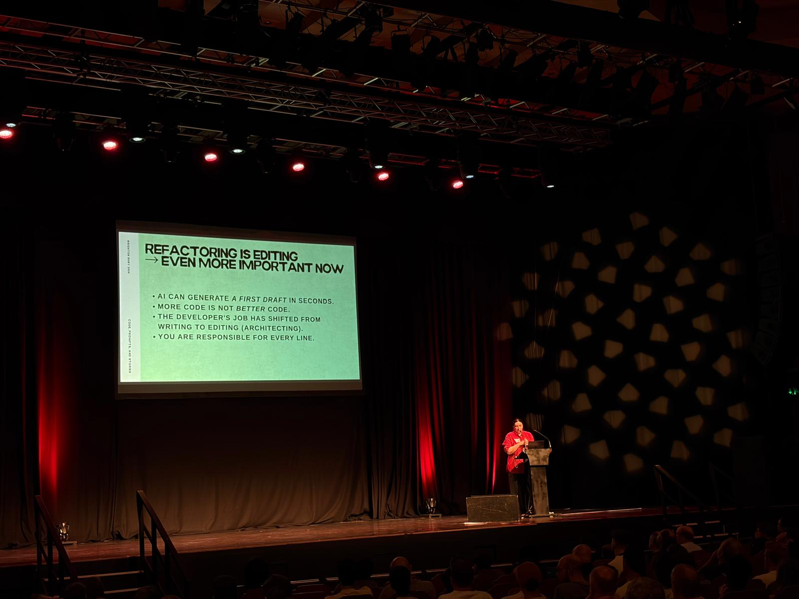
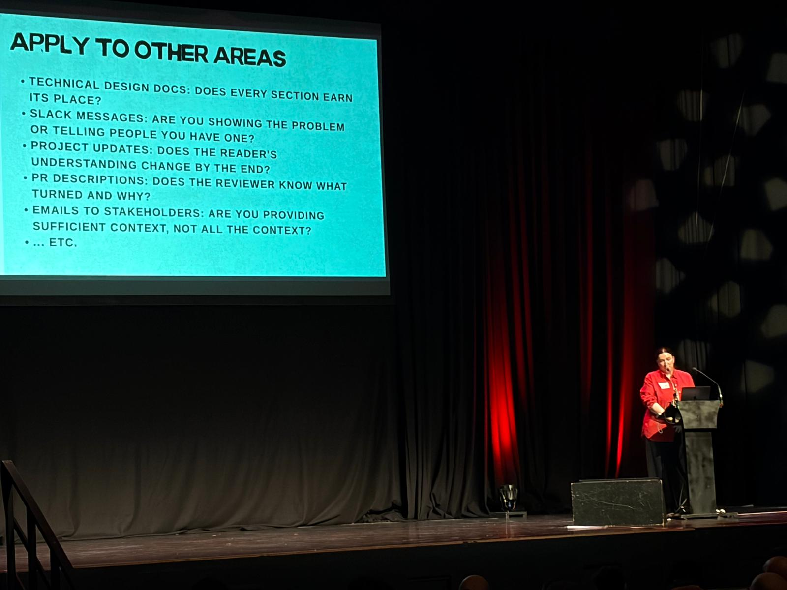
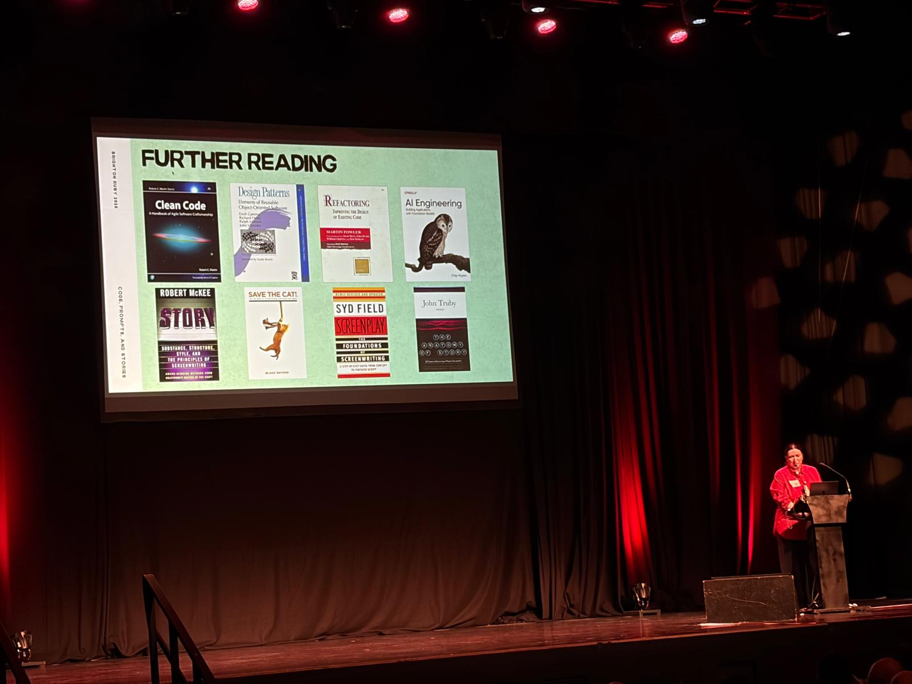

+++
date = '2026-07-18T09:15:29+01:00'
draft = false
title = 'Brighton Ruby Part 2'
+++

Now that the conference videos are up, I thought I would continue sharing my thoughts and notes from the day.

Another talk I really enjoyed was Maria Yudina’s talk comparing screenwriting and storytelling with codebase maintenance.

## Spoilers ahead  
Maria gave a major spoiler warning for the Sixth Sense at the start of the talk. Even after that there were some quite funny protests on the day. Something to be aware of as this blog post will basically be my notes from the talk.

It would be amiss at this point not to directly link you to the talk: [Code, Prompts, and Stories, Maria Yudina at Brighton Ruby 2026](https://www.youtube.com/watch?v=xy7CmdmJy1Y).

## Introduction
- Act 1 Code is Storytelling  
- Act 2 The Edit is Refactoring  
- Act 3 Prompts (are the future?)

# Act 1  
Show, don’t tell.

Mad Max for example has no exposition

| Storytelling | Ruby |
| :---- | :---- |
| Scenes explain to audience | A method name that almost doesn’t trust the audience to understand |
| Mr Exposition turns to the camera and explains their plan | Claude adds a lot of comments when it generates the code and they’re usually very redundant |

### How to improve?

- In screenwriting, good writers rely on action.
- In our case, `\#check\_if\_user\_can\_publish\_post(user, post)` becomes `\#publishable?(user, post)`.  
- Aim for elegance \- avoid “clever” metaprogramming, instead focus on making the code readable.  
- Instead of heavily nested if conditionals, just use `user.active? && user.editor? && post.draft?`

## Checkhov’s Gun

- If there’s a gun in the scene it must be used. If Act 1, must go off by Act 3\.  
- There must be a payoff.

### For example in code:

- Idea of newing up unused objects. Could have been legacy.  
  - Maybe an interface like an @audit\_log \= audit\_log, several other as it turns out unused instance variables created on object instantiation.  
- Replace with short readable classes like OrderProcessor; \#initialize(order): @order \= order. \#process: order.complete\! See [https://youtu.be/xy7CmdmJy1Y?si=N-6hZDu6rqkvhPQB\&t=350](https://youtu.be/xy7CmdmJy1Y?si=N-6hZDu6rqkvhPQB&t=350) 
  - This is easier to read  
  - Doesn’t make you assume anything  
  - Intentional \- everything in this code should be there for a reason.  
- This reminded me of another great talk from Brighton Ruby, referencing Marie Kondo: [https://brightonruby.com/2019/life-changing-magic-of-tidying-technical-debt-sroop-sunar/](https://brightonruby.com/2019/life-changing-magic-of-tidying-technical-debt-sroop-sunar/) 

### Every Scene must have a change

- If a scene doesn’t have a change it shouldn’t be in the script  
  - A character could change  
  - A dynamic or power dynamic could change  
- Scenes should be intentional \- they must be present for the story to make sense.

# The edit is the refactor

- Writing is reusing  
- Comparing writing to refactoring  
- The first draft is a prototype. Improves clarity.  
- Kill your darlings \- no confirmed origin. Faulkner? Stephen King?  
- This became key to screenwriting in the 90s.  
- Goodwill Hunting \- character driven drama movie

## Saved in the edit room

- Star Wars original cut  
- YouTube video about this  
  - Changed pacing of movies  
  - Moved things around  
- Changed on last step production  
- Oscar for Editing \- Marcia Lucas

## Refactoring and editing

- AI can generate a first draft in seconds. *More code is not better code*.
- The developer's job has shifted from writing to editing (architecting)
- You are responsible for every line [contrasted agaisnt: don't ask me, I didn't write it]
- Can I tell this story more cleanly  
- Code smell: 8 argos  
- Similar to cutting a line, simplifying the plot and cutting scenes

## Apply to other technical work
- Technical design docs: does every section earn its place?
- PR descriptions: does the *reviewer* know what changed and why?
- Project updates: does the reader's understanding change by the end?

## \[SPOILERS\]
## Plot Twist: I don’t want my code to surprise people

- Sixth Sense: dead all along  
- Bruce invisible to anyone else  
- A plot twist \- or intentional, planned from the beginning.  
- When we code we should know where we plan to get.

# Act 3

- Usually very difficult to do in films.  
- Ruby significantly closer to natural language than other programming languages.  
- Prompts as orchestration step by step  
  - Make a plan  
  - Create a spec  
  - Split off  
  - Do different tasks

References
- Maria Yudina edited AI Engineering book  
- Screenwriting: learn about it and you can annoy your friends by spoiling movies\!

