+++
date = '2026-08-30T20:31:13+01:00'
draft = false
title = 'Range on Rails'
+++

Notes on Umeda Tomohiro’s KaigiOnRails 2025 talk \- Range on Rails: How PostgreSQL Multirange Simplifies Complex Booking Logic

In July I spent some time digging through past KaigiOnRails schedules while working on a CFP application. I found this talk by Umeda Tomohiro of Rizap Technologies. His talk focused on how to build a reservation system without fixed-length time slots. I was interested in understanding the approach as I’d seen the same problem solved differently by colleagues.

My highlights were: calculating availability by subtracting unavailable time ranges; understanding how to apply PostgreSQL’s multirange feature; and learning how to implement this maintainably in Rails.

Below are my notes from his talk. I used YouTube’s translation features and Google Translate for screenshots of some slides.

Umeda Tomohiro \- 梅田智大  
Links:
- [https://kaigionrails.org/2025/talks/umeda-rizap/](https://kaigionrails.org/2025/talks/umeda-rizap/)  
- [https://speakerdeck.com/rizap\_tech/range-on-rails-duo-zhong-fan-wei-xing-toiuxin-tanaxuan-ze-zhi-ga-fu-za-rozitukuwoju-de-nisinpurunisitawake](https://speakerdeck.com/rizap_tech/range-on-rails-duo-zhong-fan-wei-xing-toiuxin-tanaxuan-ze-zhi-ga-fu-za-rozitukuwoju-de-nisinpurunisitawake)   
- [https://www.youtube.com/watch?v=FjTkun7Sv78](https://www.youtube.com/watch?v=FjTkun7Sv78)   
- [https://github.com/umeda-rizap](https://github.com/umeda-rizap) 
- https://www.postgresql.org/docs/current/rangetypes.html
- https://www.postgresql.org/docs/current/functions-range.html

"*The new “multi-range type” option dramatically simplifies complex logic.*
*chocoZAP \- the story of creating a reservation system*

- We’ve been working on a system to redesign chocoZAP’s reservation system this year.

[https://speakerdeck.com/rizap\_tech/range-on-rails-duo-zhong-fan-wei-xing-toiuxin-tanaxuan-ze-zhi-ga-fu-za-rozitukuwoju-de-nisinpurunisitawake?slide=3](https://speakerdeck.com/rizap_tech/range-on-rails-duo-zhong-fan-wei-xing-toiuxin-tanaxuan-ze-zhi-ga-fu-za-rozitukuwoju-de-nisinpurunisitawake?slide=3)  
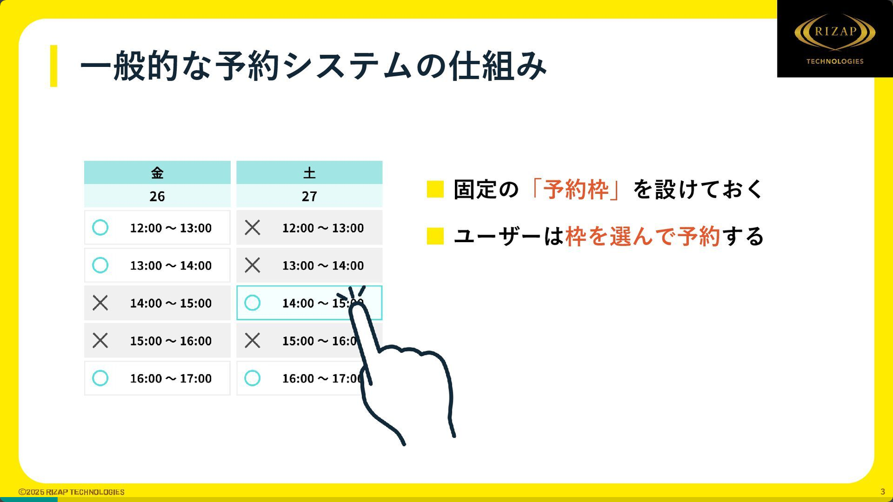
*How a general reservation system works: (1) Set aside a fixed reservation slot (2) User selects a slot and makes a reservation*

- So a typical, standard reservation system basically involves setting up fixed reservation slots in advance.  
- For example, a 12:00 slot or a 1:00PM slot, and the user selects a slot and makes a reservation. That’s how a typical reservation system wors.

[https://speakerdeck.com/rizap\_tech/range-on-rails-duo-zhong-fan-wei-xing-toiuxin-tanaxuan-ze-zhi-ga-fu-za-rozitukuwoju-de-nisinpurunisitawake?slide=4](https://speakerdeck.com/rizap_tech/range-on-rails-duo-zhong-fan-wei-xing-toiuxin-tanaxuan-ze-zhi-ga-fu-za-rozitukuwoju-de-nisinpurunisitawake?slide=4)  
  
*Features of chocoZAP’s reservation system*

- *24 unmanned operation*  
- *Users want to use it casually during their free time*  
- *We want to make it possible to “book at any time you like”*

*In other words… a reservation system that isn’t bound by time slots\!*

- However, one of the features of chocoZap’s reservation is that chocoZap is a 24-hour unmanned convenience store gym and we want users to be able to use it easily in their spare time.  
- For example there are cases where you might have a little free time in 30 minutes and you want to use that time to make a reservation, and use chocoZap.  
- So instead of setting up fixed time slots in advance we needed to create a reservation system where people could freely book at any time they liked \- in other words, a reservation system without fixed time slots.

[https://speakerdeck.com/rizap\_tech/range-on-rails-duo-zhong-fan-wei-xing-toiuxin-tanaxuan-ze-zhi-ga-fu-za-rozitukuwoju-de-nisinpurunisitawake?slide=5](https://speakerdeck.com/rizap_tech/range-on-rails-duo-zhong-fan-wei-xing-toiuxin-tanaxuan-ze-zhi-ga-fu-za-rozitukuwoju-de-nisinpurunisitawake?slide=5)   
*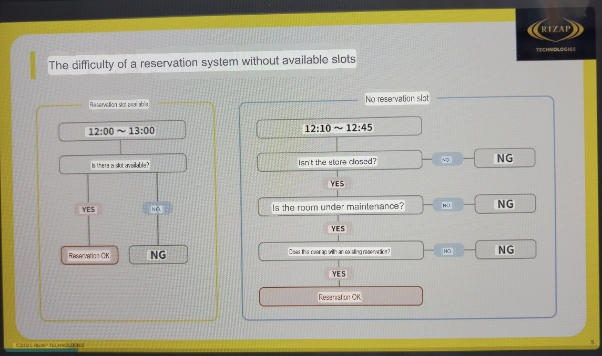*  
*The difficulty of a reservation system without available slots* - *Translated using Google Translate to preserve flowchart structure.*
- However, creating a reservation system without pre-defined slots is quite difficult.  
- For example, in a reservation system with pre-defined slots, you can determine whether a reservation is actually possible by checking whether the slot is open or full. It’s a simple binary decision.  
- So, in the case of a reservation system that doesn’t have a fixed time slot; for example, when trying to determine whether a reservation can be made in 30 minutes, you have to consider whether another user has already made a reservation at that time, or whether the store is temporarily closed and reservations cannot be made during that period, or whether the store is open but the machine is broken and reservations cannot be made temporarily.  
- In such cases, you have to check all these various conditions under which reservations cannot be made in order to actually determine whether a reservation can be made.

[https://speakerdeck.com/rizap\_tech/range-on-rails-duo-zhong-fan-wei-xing-toiuxin-tanaxuan-ze-zhi-ga-fu-za-rozitukuwoju-de-nisinpurunisitawake?slide=6](https://speakerdeck.com/rizap_tech/range-on-rails-duo-zhong-fan-wei-xing-toiuxin-tanaxuan-ze-zhi-ga-fu-za-rozitukuwoju-de-nisinpurunisitawake?slide=6)   
  
*Even if there are no available slots, I’d like to see a list of available slots. Since there is no physical “slot” system, creating a list of available slots is extremely difficult.*

- So, although there are no available slots, there is a request to be able to see the availability and booking status for the past week on a list screen like this.  
- Well, I’d like to see a list of available times so I can see which time slots are already booked and which ones are available for booking.  
- But there aren’t any slots available, so figuring out how to display a screen like this is a very difficult task.

[https://speakerdeck.com/rizap\_tech/range-on-rails-duo-zhong-fan-wei-xing-toiuxin-tanaxuan-ze-zhi-ga-fu-za-rozitukuwoju-de-nisinpurunisitawake?slide=7](https://speakerdeck.com/rizap_tech/range-on-rails-duo-zhong-fan-wei-xing-toiuxin-tanaxuan-ze-zhi-ga-fu-za-rozitukuwoju-de-nisinpurunisitawake?slide=7)  
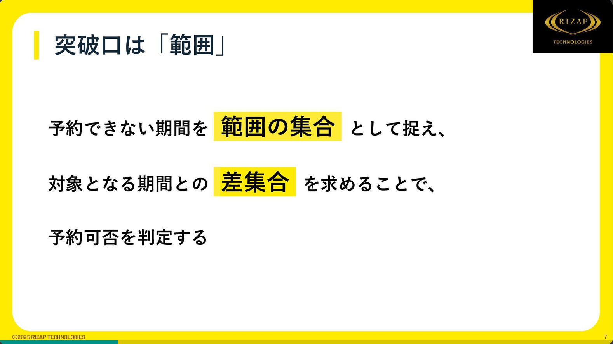  
*The breakthrough is “scope”. By treating the periods during which reservations are unavailable as a set of ranges and calculating the difference between these ranges and the target period, we can determine whether a reservation is possible.*

- So, after much trial and error and consideration, I arrived at the idea of a scope.  
- I can’t make a reservation, so I want to check the reservation by treating various rough time periods as a set of ranges, and by finding the left set with the target period, I can drive the period during which reservations are possible.  
- Well by taking this approach, we were able to simplify this complex logic.  
- So today I’d like to talk about this in more detail.

[https://speakerdeck.com/rizap\_tech/range-on-rails-duo-zhong-fan-wei-xing-toiuxin-tanaxuan-ze-zhi-ga-fu-za-rozitukuwoju-de-nisinpurunisitawake?slide=8](https://speakerdeck.com/rizap_tech/range-on-rails-duo-zhong-fan-wei-xing-toiuxin-tanaxuan-ze-zhi-ga-fu-za-rozitukuwoju-de-nisinpurunisitawake?slide=8) 

- Let me introduce myself.  
- I’m a backend engineer at RIZUP Technologies  
- I’m mainly in charge of system development and operation for ChocoZAP, the convenience store management app for beginners.

[https://speakerdeck.com/rizap\_tech/range-on-rails-duo-zhong-fan-wei-xing-toiuxin-tanaxuan-ze-zhi-ga-fu-za-rozitukuwoju-de-nisinpurunisitawake?slide=9](https://speakerdeck.com/rizap_tech/range-on-rails-duo-zhong-fan-wei-xing-toiuxin-tanaxuan-ze-zhi-ga-fu-za-rozitukuwoju-de-nisinpurunisitawake?slide=9) 

- So since ChocoZap has stores all over the country, we are mainly in charge of development that is unique to having physical stores all over the country, such as understanding the real-time situation of each store nationwide, delivering information to customers, managing data, and also developing a system to optimize and manage store resources by linking these various pieces of equipment in the stores using IoT, and also developing the reservation system that I will talk about today.

[https://speakerdeck.com/rizap\_tech/range-on-rails-duo-zhong-fan-wei-xing-toiuxin-tanaxuan-ze-zhi-ga-fu-za-rozitukuwoju-de-nisinpurunisitawake?slide=10](https://speakerdeck.com/rizap_tech/range-on-rails-duo-zhong-fan-wei-xing-toiuxin-tanaxuan-ze-zhi-ga-fu-za-rozitukuwoju-de-nisinpurunisitawake?slide=10)

- Back to the main topic.

[https://speakerdeck.com/rizap\_tech/range-on-rails-duo-zhong-fan-wei-xing-toiuxin-tanaxuan-ze-zhi-ga-fu-za-rozitukuwoju-de-nisinpurunisitawake?slide=11](https://speakerdeck.com/rizap_tech/range-on-rails-duo-zhong-fan-wei-xing-toiuxin-tanaxuan-ze-zhi-ga-fu-za-rozitukuwoju-de-nisinpurunisitawake?slide=11)  
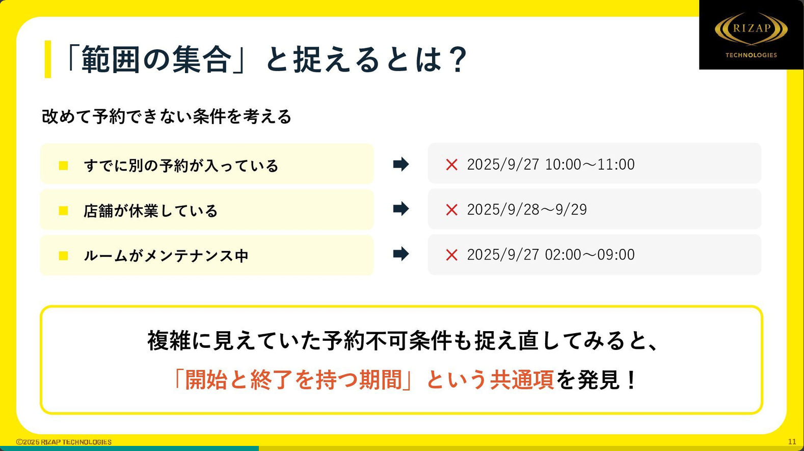
*What does it mean to consider something as a “set of ranges”?*

- *Consider the conditions under which you cannot make a reservation again.*  
  - *I already have another reservation	\-\> X 27/9/2025 10:00\~11:00*  
  - *Store is closed				\-\> X 28/9/2025 \~ 29/9/2025*  
  - *Room is under maintenance		\-\> X 27/9/2025 02:00\~09:00*  
- *When we re-examined the seemingly complex conditions for making reservations impossible, we discovered a common thread; “a period with a start and end date”.*

- Earlier I talked about how we can view the various conditions under which reservations cannot be made as a set of ranges.  
- What this means is that we will take another look at the various conditions under which reservations cannot be made.  
- Well, there are various reasons why you can’t make a reservation, such as the store being closed or other such conditions.  
- But in any case, there is a period of time where you can’t make a reservation. For example, if a user has already made a reservation, it will say that the user has made a reservation from a certain time or a certain time and that time slot cannot be reserved.  
- Also, if the store is closed, it will say that reservations cannot be made from a certain time to a certain time, and the store is closed, and that time slot cannot be reserved.  
- There are many different conditions like this, and they all have a period from start to finish, and although there are many different conditions, we found a common thread that they are all periods.

[https://speakerdeck.com/rizap\_tech/range-on-rails-duo-zhong-fan-wei-xing-toiuxin-tanaxuan-ze-zhi-ga-fu-za-rozitukuwoju-de-nisinpurunisitawake?slide=12](https://speakerdeck.com/rizap_tech/range-on-rails-duo-zhong-fan-wei-xing-toiuxin-tanaxuan-ze-zhi-ga-fu-za-rozitukuwoju-de-nisinpurunisitawake?slide=12)   
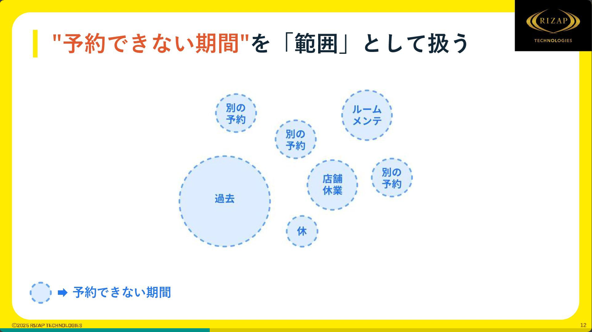  
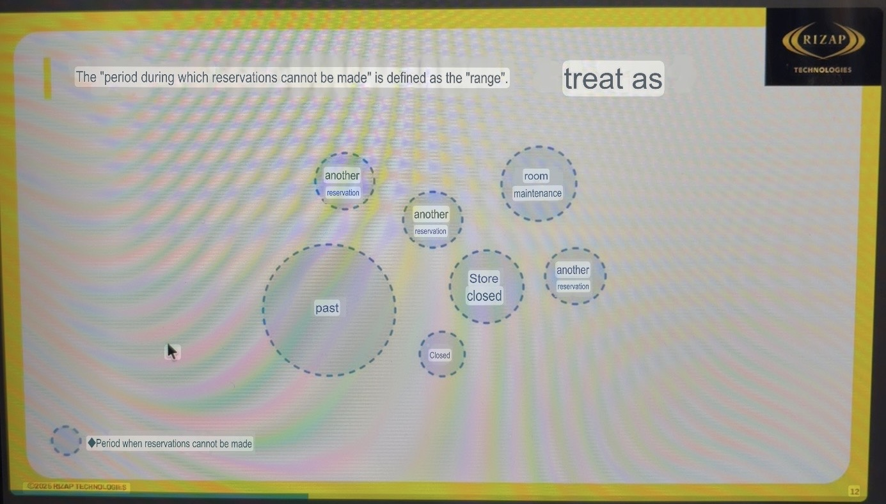
*The period during which reservations cannot be made is defined as the “range”* \- shown here as circles outlined with dotted lines.

- So I thought that if we replaced this “period” with a “range”, we could simplify the logic and so we’ll convert these various periods when reservations are unavailable into ranges.

[https://speakerdeck.com/rizap\_tech/range-on-rails-duo-zhong-fan-wei-xing-toiuxin-tanaxuan-ze-zhi-ga-fu-za-rozitukuwoju-de-nisinpurunisitawake?slide=13](https://speakerdeck.com/rizap_tech/range-on-rails-duo-zhong-fan-wei-xing-toiuxin-tanaxuan-ze-zhi-ga-fu-za-rozitukuwoju-de-nisinpurunisitawake?slide=13)   
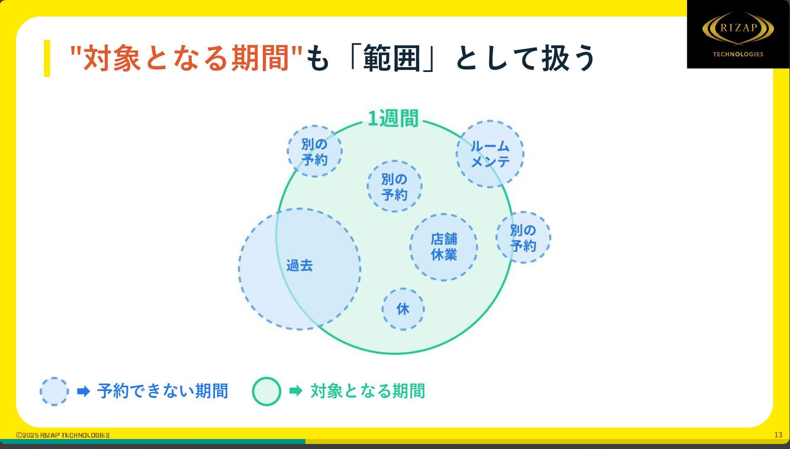  
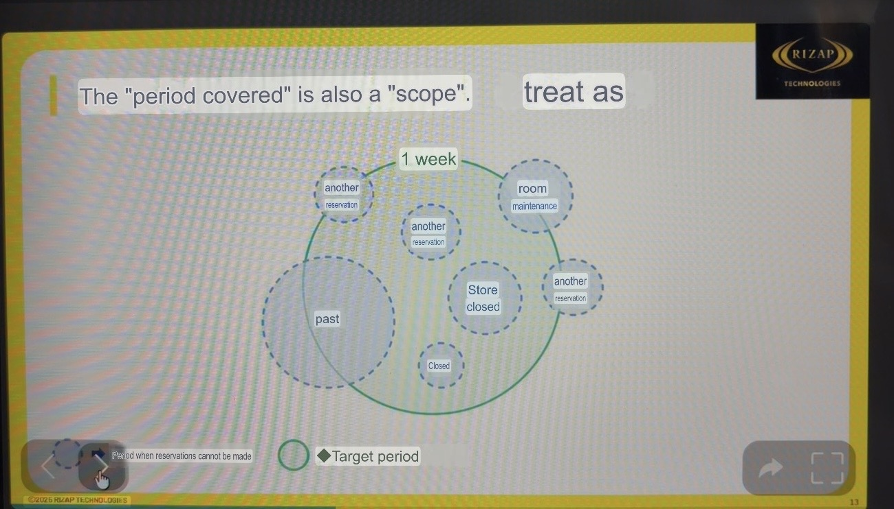
*The period covered is also a scope \-* shown here as the shaded green circle marked “target period”

- So for example, if you want to check the availability of reservations for the next week, you would replace this “one week” period with a range.

[https://speakerdeck.com/rizap\_tech/range-on-rails-duo-zhong-fan-wei-xing-toiuxin-tanaxuan-ze-zhi-ga-fu-za-rozitukuwoju-de-nisinpurunisitawake?slide=14](https://speakerdeck.com/rizap_tech/range-on-rails-duo-zhong-fan-wei-xing-toiuxin-tanaxuan-ze-zhi-ga-fu-za-rozitukuwoju-de-nisinpurunisitawake?slide=14)   
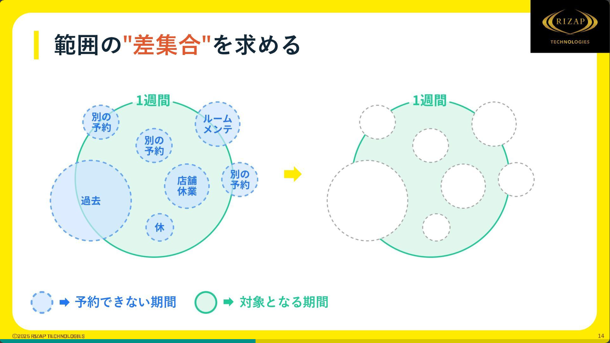
*“Find the set difference of the ranges” \- between shaded in blue the Period when reservations cannot be made, and in green the 1 week period covered.*

- So, by doing this, if we find the left set of this one-week period and various other periods when reservations are not possible…

[https://speakerdeck.com/rizap\_tech/range-on-rails-duo-zhong-fan-wei-xing-toiuxin-tanaxuan-ze-zhi-ga-fu-za-rozitukuwoju-de-nisinpurunisitawake?slide=15](https://speakerdeck.com/rizap_tech/range-on-rails-duo-zhong-fan-wei-xing-toiuxin-tanaxuan-ze-zhi-ga-fu-za-rozitukuwoju-de-nisinpurunisitawake?slide=15)   

*Results of finding the “set difference” \- in the remaining range, reservations are open\!*

- The remaining range is the period when reservations are possible.  
- So by doing this, although there are various conditions under which reservations cannot be made, we thought that the period during which reservations are possible could be determined in one go, so we decided to take this approach and proceed with development.

[https://speakerdeck.com/rizap\_tech/range-on-rails-duo-zhong-fan-wei-xing-toiuxin-tanaxuan-ze-zhi-ga-fu-za-rozitukuwoju-de-nisinpurunisitawake?slide=16](https://speakerdeck.com/rizap_tech/range-on-rails-duo-zhong-fan-wei-xing-toiuxin-tanaxuan-ze-zhi-ga-fu-za-rozitukuwoju-de-nisinpurunisitawake?slide=16)   
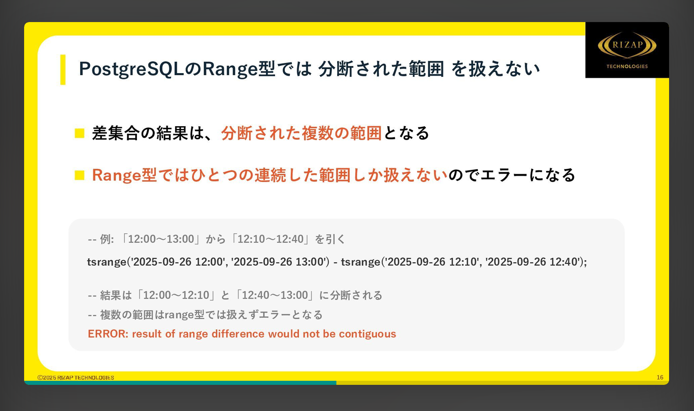  
*PostgreSQL’s Range Type cannot handle fragmented ranges.*

- *The result of the set different is multiple separated ranges.*  
- *The Range type can only handle a single contiguous range, so this will result in an error.*

*Example: Subtract “12:10\~12:40” from “12:00\~13:00”.*

- *tsrange(‘2025-09-26 12:00’, ‘2025-09-26 13:00’) \- tsrange(‘2025-09-26 12:10’, ‘2025-09-26 12:40’);*

*The results are divided into “12:00\~12:10” and “12:40\~13:00”.*

- *Multiple ranges cannot be handled with the range type and will result in an error.*  
- *ERROR: result of range difference would not be contiguous.*

- However, there is one problem here.  
- PostgreSQL’s usual range type, can’t handle segmented ranges.  
- So what I mean is when you take the left set and find the period during which reservations are possible, for example, you can make a reservation from 12:00 to 13:00.  
- However you can’t make a reservation between 1pm and 2pm. But you can make a reservation from 2pm to 3pm.  
- So I think the reservation period is scattered across multiple time slots.  
- However a typical range-type calculator can only handle one continuos range, so when you have multiple scattered ranges like this, it actually results in an error.

[https://speakerdeck.com/rizap\_tech/range-on-rails-duo-zhong-fan-wei-xing-toiuxin-tanaxuan-ze-zhi-ga-fu-za-rozitukuwoju-de-nisinpurunisitawake?slide=17](https://speakerdeck.com/rizap_tech/range-on-rails-duo-zhong-fan-wei-xing-toiuxin-tanaxuan-ze-zhi-ga-fu-za-rozitukuwoju-de-nisinpurunisitawake?slide=17)   
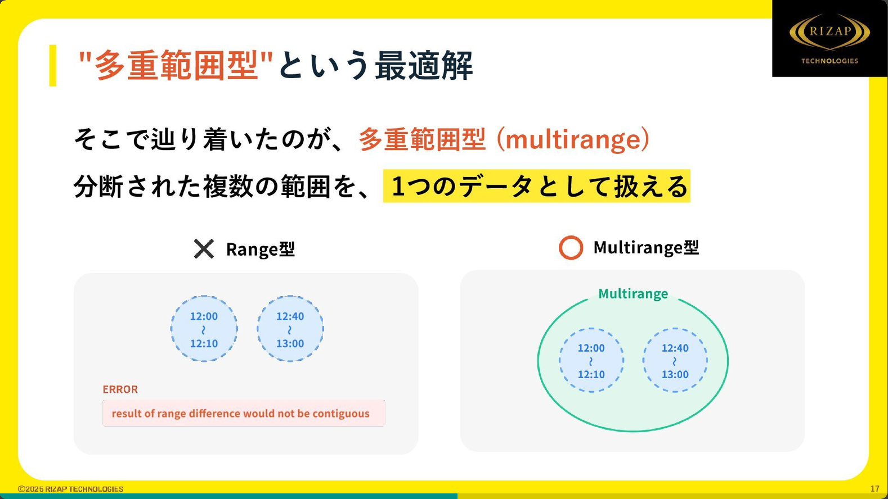
*The optimal solution is a “multi-range type”*  
*That’s where the idea of multirange comes in. Multiple fragmented ranges can be treated as a single data point.*

- So, what I ultimately arrived at was the multi-range type.  
- The multi-range type allows you to treat multiple divided ranges as a singel data point.

[https://speakerdeck.com/rizap\_tech/range-on-rails-duo-zhong-fan-wei-xing-toiuxin-tanaxuan-ze-zhi-ga-fu-za-rozitukuwoju-de-nisinpurunisitawake?slide=18](https://speakerdeck.com/rizap_tech/range-on-rails-duo-zhong-fan-wei-xing-toiuxin-tanaxuan-ze-zhi-ga-fu-za-rozitukuwoju-de-nisinpurunisitawake?slide=18)  
*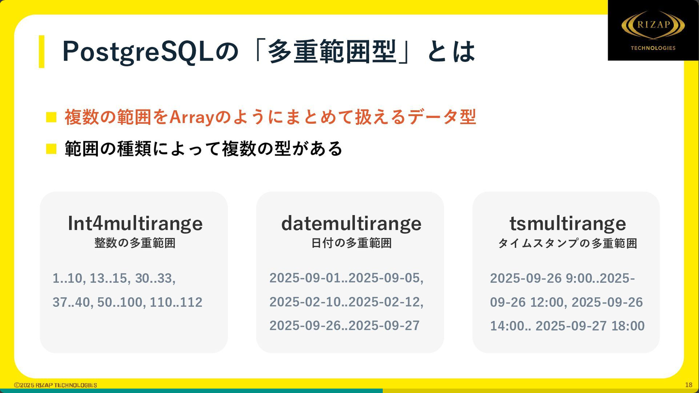*  
*What is a “multi-range type” in PostgreSQL?*

- *A data type that can handle multiple ranges together, like an array.*  
- *There are multiple types depending on the range:*  
  - *Int4multirange*  
  - *datemultirange*  
  - *tsmultirange*

- To put it more simply, it’s a data type that’s similar to how multiple ranges are crammed into a single array.  
- Depending on the type of range, there are also different types of multiple overlapping ranges.

[https://speakerdeck.com/rizap\_tech/range-on-rails-duo-zhong-fan-wei-xing-toiuxin-tanaxuan-ze-zhi-ga-fu-za-rozitukuwoju-de-nisinpurunisitawake?slide=19](https://speakerdeck.com/rizap_tech/range-on-rails-duo-zhong-fan-wei-xing-toiuxin-tanaxuan-ze-zhi-ga-fu-za-rozitukuwoju-de-nisinpurunisitawake?slide=19)  
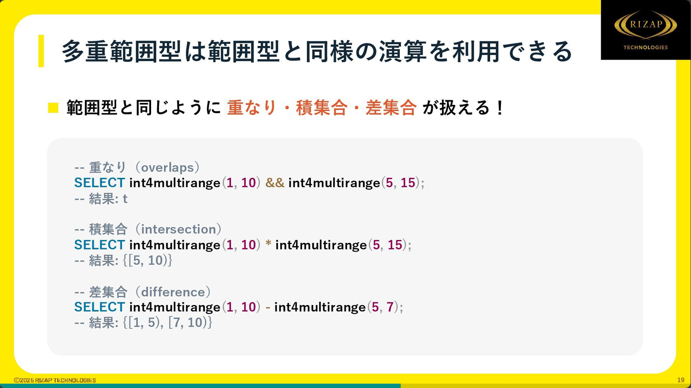
*Multiple range types can use the same operations as range types. Just like with range types, you can handle overlap, intersection and difference\!*

- So this multi-range type, well, just like a regular range type, can be used with operations.  
- For example, you can determine whether two ranges overlap, extract only the overlapping parts to find a set of *stones*, or conversely, extract the parts that don’t overlap, the left set.  
- You can use operations on these ranges just like with regular range types.

[https://speakerdeck.com/rizap\_tech/range-on-rails-duo-zhong-fan-wei-xing-toiuxin-tanaxuan-ze-zhi-ga-fu-za-rozitukuwoju-de-nisinpurunisitawake?slide=20](https://speakerdeck.com/rizap_tech/range-on-rails-duo-zhong-fan-wei-xing-toiuxin-tanaxuan-ze-zhi-ga-fu-za-rozitukuwoju-de-nisinpurunisitawake?slide=20)   
  
*Create a list of available reservations using the “multi-range type”*  
*1 Consolidate multiple periods that are unavailable for booking into multiple timeframes.*  
*2 The period for checking availability is also converted to a multi-range*  
*3 Calculate the available reservation period using the set different method*

- So since we have all the necessary tools, I think we can use a multi-range method to find a list of available reservation periods using the original range and the left set of ranges.  
- We’ll do this in three steps.

[https://speakerdeck.com/rizap\_tech/range-on-rails-duo-zhong-fan-wei-xing-toiuxin-tanaxuan-ze-zhi-ga-fu-za-rozitukuwoju-de-nisinpurunisitawake?slide=21](https://speakerdeck.com/rizap_tech/range-on-rails-duo-zhong-fan-wei-xing-toiuxin-tanaxuan-ze-zhi-ga-fu-za-rozitukuwoju-de-nisinpurunisitawake?slide=21)   
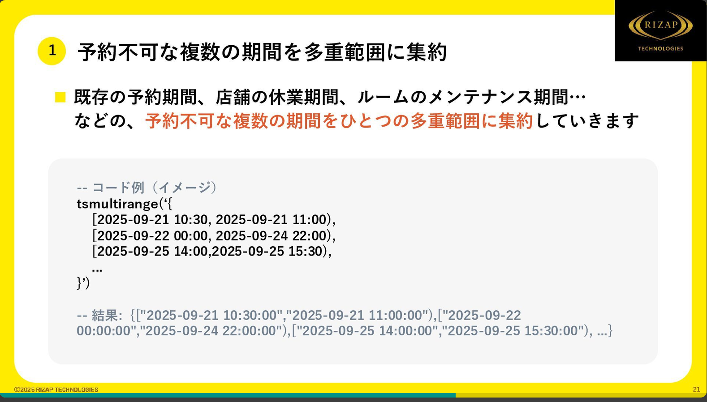 
*Consolidate multiple periods that are unavailable for booking into multiple timeframes.*

- *We will consolidate multiple periods during which reservations are unavailable, such as existing reservation periods, store closure periods, and room maintenance periods, into a single overlapping timeframe.*

Step 1

- First, as the first step, we will combine the multiple periods during which reservations are unavailable into a single overlapping period.  
- We’ll just cram all those periods when reservations can’t be made \- like existing user reservations, store closures, room maintenance periods, etc, into one more multi-layered timeframe.

[https://speakerdeck.com/rizap\_tech/range-on-rails-duo-zhong-fan-wei-xing-toiuxin-tanaxuan-ze-zhi-ga-fu-za-rozitukuwoju-de-nisinpurunisitawake?slide=22](https://speakerdeck.com/rizap_tech/range-on-rails-duo-zhong-fan-wei-xing-toiuxin-tanaxuan-ze-zhi-ga-fu-za-rozitukuwoju-de-nisinpurunisitawake?slide=22)   
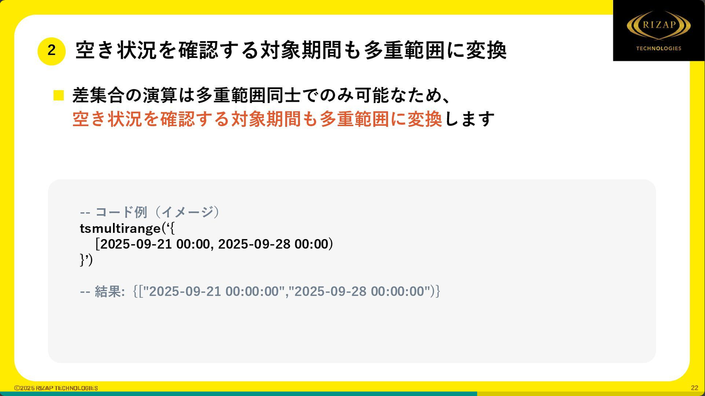 
*The period for checking availability has also been converted to a multi-range scope.*  
*Since the set difference operation is only possible between multiple ranges, the time period to check availability is also converted to a multiple range.*

- Next, as step 2, if you want to check the availability for the past week, you convert this one-week period into a multi-range period.  
- Well, a week is a single continuous period, but since multi-range operations require that both values be of multi-range type, we convert this one week period into a multi-range.

[https://speakerdeck.com/rizap\_tech/range-on-rails-duo-zhong-fan-wei-xing-toiuxin-tanaxuan-ze-zhi-ga-fu-za-rozitukuwoju-de-nisinpurunisitawake?slide=23](https://speakerdeck.com/rizap_tech/range-on-rails-duo-zhong-fan-wei-xing-toiuxin-tanaxuan-ze-zhi-ga-fu-za-rozitukuwoju-de-nisinpurunisitawake?slide=23)  

*Calculate the available reservation period using the set difference method\!*

- *Calculate the difference between the multiple ranges of periods for which unavailability can be checked and the multiple ranges of periods for which reservations are unavailable\!*  
- *The result of the set difference will be the period during which reservations are possible.*

- And finally, the third step.  
- By taking the left set of this overlapping range of “one week” and the overlapping range that combines various periods when reservations are not possible, we were able to instantly derive a list of periods when reservations are possible.

[https://speakerdeck.com/rizap\_tech/range-on-rails-duo-zhong-fan-wei-xing-toiuxin-tanaxuan-ze-zhi-ga-fu-za-rozitukuwoju-de-nisinpurunisitawake?slide=24](https://speakerdeck.com/rizap_tech/range-on-rails-duo-zhong-fan-wei-xing-toiuxin-tanaxuan-ze-zhi-ga-fu-za-rozitukuwoju-de-nisinpurunisitawake?slide=24)   
 
*The “mutli-range type” has a variety of applications*

- *Subscription usage period (multiple periods including suspension and resumption)*  
- *Attendance shift management (managing work, break, and overtime times collectively*  
- *Content distribution/viewing time aggregation (multi-segment aggregation of viewing sessions)*  
- *Inventory and loan management (calculating vacancy periods using a difference-based approach based on loans and returns)*  
- *System failure occurrence and recovery time management (including calculation of failure rate).*

*When aggregating data across multiple disparate time periods, the multirange approach may prove very useful.*

- So, we’ve been talking about reservation systems up until now, and as I’ve just explained, I think the multi-range type is extremely effective in this reservation system, but I also think this multi-range type can be used in various other situations besides reservation systems, so I’ve put together this slide.  
- I’ve written about various things but basically I think that the multi-range type will be very useful in situations where you want to somehow aggregate data from multiple periods, even if it’s a bit rough.

[https://speakerdeck.com/rizap\_tech/range-on-rails-duo-zhong-fan-wei-xing-toiuxin-tanaxuan-ze-zhi-ga-fu-za-rozitukuwoju-de-nisinpurunisitawake?slide=25](https://speakerdeck.com/rizap_tech/range-on-rails-duo-zhong-fan-wei-xing-toiuxin-tanaxuan-ze-zhi-ga-fu-za-rozitukuwoju-de-nisinpurunisitawake?slide=25) 

- So now that we understand multi-range types, I’d like to talk about how to handle these multi-range types in Rails.

[https://speakerdeck.com/rizap\_tech/range-on-rails-duo-zhong-fan-wei-xing-toiuxin-tanaxuan-ze-zhi-ga-fu-za-rozitukuwoju-de-nisinpurunisitawake?slide=26](https://speakerdeck.com/rizap_tech/range-on-rails-duo-zhong-fan-wei-xing-toiuxin-tanaxuan-ze-zhi-ga-fu-za-rozitukuwoju-de-nisinpurunisitawake?slide=26)   
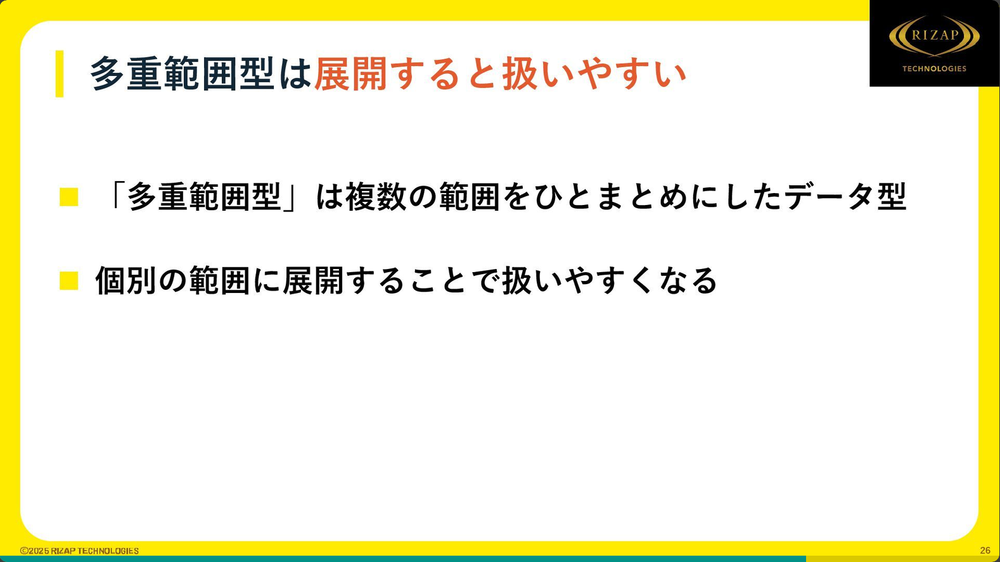 
*Multi-range types are easier to handle when expected*  
*A “multi-range type” is a data type that groups multiple ranges together.*  
*It becomes easier to handle when expanded into individual areas.*

- So, when dealing with this multi-range type in Rails, it’s easier to handle if you expand it into multiple ranges.  
- Well, that’s because if you retrieve this multi-range data through ActiveRecord in Rails, you’ll get just a simple string back.  
- However, I think it can be quite difficult to handle when a string is returned.  
- Well, multi-range types do become strings, but with regular range types, the data can be obtained by mapping it to a range object, so I think it’s easier to handle.  
- As I mentioned earlier, a multi-range type is a data type that packs multiple ranges into a single array, so if we expand it into multiple individual ranges, we can treat it as a regular range object, which I think makes writing code easier.

[https://speakerdeck.com/rizap\_tech/range-on-rails-duo-zhong-fan-wei-xing-toiuxin-tanaxuan-ze-zhi-ga-fu-za-rozitukuwoju-de-nisinpurunisitawake?slide=27](https://speakerdeck.com/rizap_tech/range-on-rails-duo-zhong-fan-wei-xing-toiuxin-tanaxuan-ze-zhi-ga-fu-za-rozitukuwoju-de-nisinpurunisitawake?slide=27)  
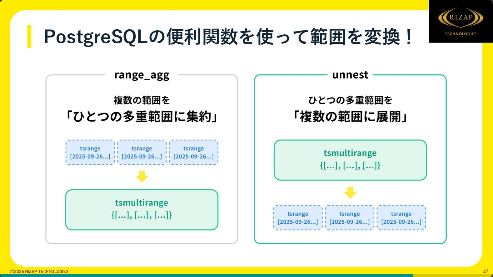 
*Use PostgreSQL’s convenient functions to convert ranges\!*  
*Range\_agg:	“Combine multiple ranges into a single multi-range range”*  
*Unnest:	“Expanding one multi-range to ‘multiple ranges’”*

- PostgreSQL provides convenient functions for expanding and aggregating these multi-ranges.  
- For example, using the Range Aggregate \- range\_agg \- function, you consolidate multiple disorganised ranges into a single multi-range.  
- Conversely, using the *unnested* function, we can expand this single multi-range into multiple separate ranges.  
- Therefore, I think it would be a good idea to use like Range Aggregate or Unnested to convert the data into a format that is easy to handle in Rails.

[https://speakerdeck.com/rizap\_tech/range-on-rails-duo-zhong-fan-wei-xing-toiuxin-tanaxuan-ze-zhi-ga-fu-za-rozitukuwoju-de-nisinpurunisitawake?slide=28](https://speakerdeck.com/rizap_tech/range-on-rails-duo-zhong-fan-wei-xing-toiuxin-tanaxuan-ze-zhi-ga-fu-za-rozitukuwoju-de-nisinpurunisitawake?slide=28)  
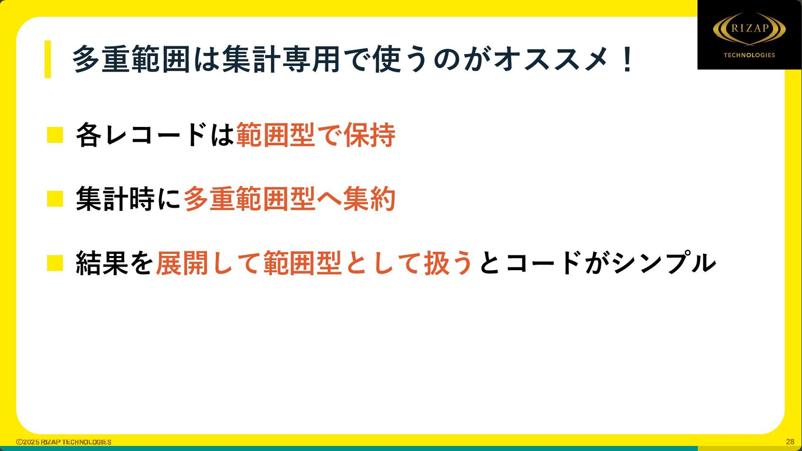
*Multiple ranges are best used exclusively for aggregation\!*  
*Each record is stored as a range*  
*Aggregation into multiple range types during aggregation*  
*Expanding the result and treating it as a range type simplifies the code*

- I recommend using this multi-range feature specifically for summary lines.  
- The reason is, if you try to manage the various periods when reservations cannot be made in the database using multiple ranges, like trying to manage the reservations of various users or the closure periods of various stores in a single multiple range, it wold be quite difficult to update or manipulate the data when a user’s reservation is canceled or a store’s closure period is extended.  
- So in reality, each table has data where each record represents one period and one range, and then when you want to perform some kind of aggregation, you consolidate it into multiple ranges.  
- So, I think that by aggregating results and then spreading them out into individual, separate ranges, it becomes easier to handle.

[https://speakerdeck.com/rizap\_tech/range-on-rails-duo-zhong-fan-wei-xing-toiuxin-tanaxuan-ze-zhi-ga-fu-za-rozitukuwoju-de-nisinpurunisitawake?slide=29](https://speakerdeck.com/rizap_tech/range-on-rails-duo-zhong-fan-wei-xing-toiuxin-tanaxuan-ze-zhi-ga-fu-za-rozitukuwoju-de-nisinpurunisitawake?slide=29)   
  
*Simplify your code using SQL View*

- *Multirange types are not supported in Rails*  
  - *Trying to handle things with ActiveRecord tends to make things more complex*  
- *Complex aggregation processes are confined to SQL views \[?\]*  
  - *Handling multirange types can be done entirely with SQL*  
- *Simplify your code by creating a VIEW-based model*  
  - *Rails allows you to handle multiple ranges without having to be aware of them.*

- Now, I think this is something that people will have different opinions on, and it’s just my personal preference, but I think that using SQL View for this aggregation process will make the process simpler.  
- So, if you use SQL Views, there are still various issues, such as how to maintain these views, but I think there aren’t that many situations where you want to use multiple ranges to perform complex aggregations.  
- Well, for example, even if there is one system like this reservation system, I think there are only one or two locations at most, so the complexity of the SQL there can be handled with this SQL view, and in Rails, or rather Ruby, if you handle only the final aggregated result as an object, I think the code will be easier to write and easier to read.

[https://speakerdeck.com/rizap\_tech/range-on-rails-duo-zhong-fan-wei-xing-toiuxin-tanaxuan-ze-zhi-ga-fu-za-rozitukuwoju-de-nisinpurunisitawake?slide=30](https://speakerdeck.com/rizap_tech/range-on-rails-duo-zhong-fan-wei-xing-toiuxin-tanaxuan-ze-zhi-ga-fu-za-rozitukuwoju-de-nisinpurunisitawake?slide=30)  
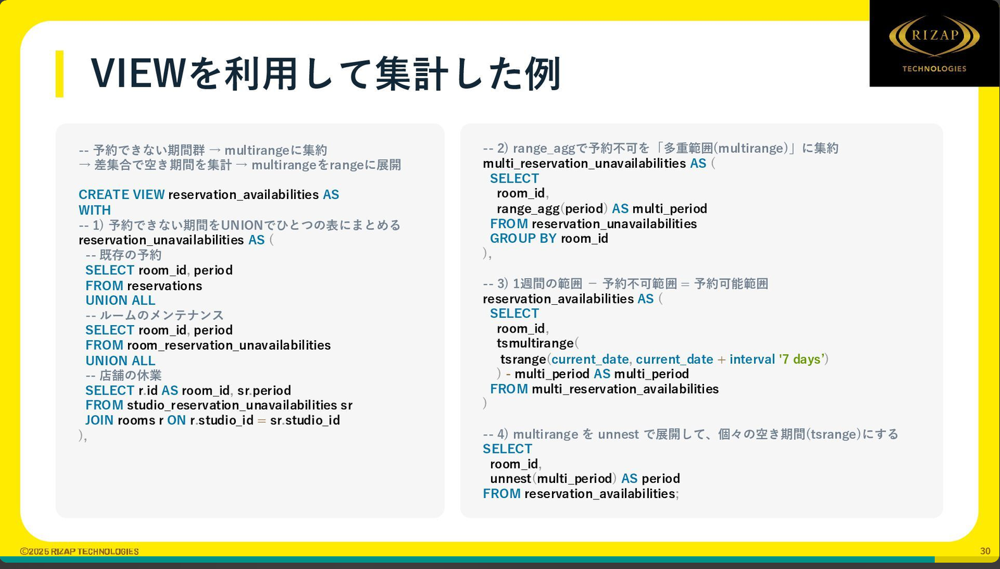
*Example of aggregation using VIEW*  
*Group unavailable periods into multirange \- Aggregate available periods using the difference set \- Expand multirange into range*  
*Key*

1) *Consolidate the periods when reservations cannot be made into a single table using UNION*  
   1) *Existing reservation*  
   2) *Room maintenance*  
   3) *Store closure*  
2) *Group unavailable items into “multirange” using range\_agg*  
3) *1-week range \- Unavailable range \= Available range*  
4) *Unnest the multirange to create individual free periods (tsrange)*

- So, here’s an example of how to collect data using SQL views.  
- Well, I’ve written a lot of jumbled stuff, but basically, as I mentioned earlier, I’ve consolidated all the periods where reservations can’t be made into one multi-range.  
- Then I’ve taken the left set, performed the calculations, and finally, I’ve used the unsent feedback to expand on the resulting multi-range.

[https://speakerdeck.com/rizap\_tech/range-on-rails-duo-zhong-fan-wei-xing-toiuxin-tanaxuan-ze-zhi-ga-fu-za-rozitukuwoju-de-nisinpurunisitawake?slide=31](https://speakerdeck.com/rizap_tech/range-on-rails-duo-zhong-fan-wei-xing-toiuxin-tanaxuan-ze-zhi-ga-fu-za-rozitukuwoju-de-nisinpurunisitawake?slide=31)   
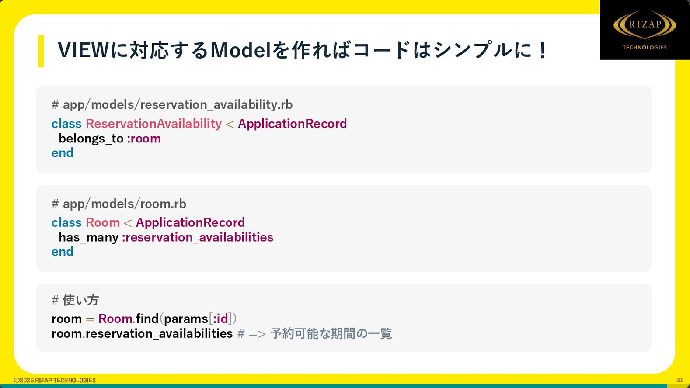
*Creating a Model that corresponds to the View  simplifies the code\!*  
*3\) How to use*  
*Room.reservation\_availabilities \=\> List of available reservation periods*

- So, by using this SQL View, we can ultimately create a model for this view, and as you can see at the very bottom of the usage section at the bottom of this slide, when we finally make a model named like RoomAvailability, we can get a list of objects that have this reservable period.  
- And by doing this, I think the code will become simpler and easier to use.

[https://speakerdeck.com/rizap\_tech/range-on-rails-duo-zhong-fan-wei-xing-toiuxin-tanaxuan-ze-zhi-ga-fu-za-rozitukuwoju-de-nisinpurunisitawake?slide=32](https://speakerdeck.com/rizap_tech/range-on-rails-duo-zhong-fan-wei-xing-toiuxin-tanaxuan-ze-zhi-ga-fu-za-rozitukuwoju-de-nisinpurunisitawake?slide=32)   
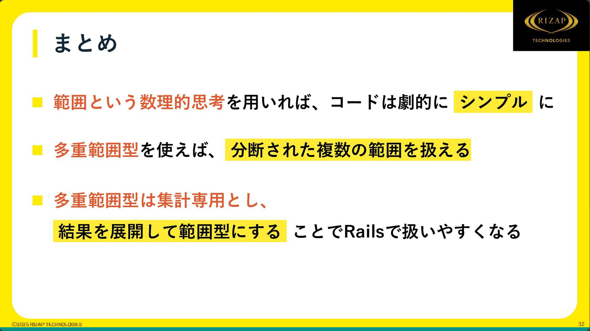 
*Summary*

- *By using mathematical thinking about ranges, the code becomes dramatically simpler*  
- *Using multi-range types allows you to handle multiple separated ranges*  
- *Multiple range types are used exclusively for aggregation, and expanding the results into range types makes them easier to handle in Rails.*

- So to summarize, I think that by using this mathematical thinking about ranges, there are situations where the degree of complexity becomes dramatically simpler.  
- So, when performing aggregations using these kinds of ranges, having a multi-range type allows you to handle multiple ranges simultaneously.  
- And this multi-range approach, well, is used specifically for aggregation, and the final result obtained can then be expanded into individual ranges and treated as a range object, which I think makes the code easier to read and write."