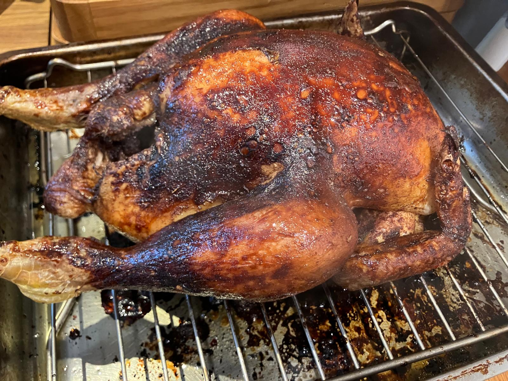

+++
date = '2026-03-02T20:05:58Z'
draft = false
title = 'Peking Roast Chicken'
+++

I developed this recipe after we had some friends over after a much larger whole chicken arrived in our weekly food shop. It is inspired by Andrew Wong’s peking duck recipe and Pups with Chopsticks’ Peking Chicken recipe: [https://www.greatbritishchefs.com/recipes/peking-duck-recipe](https://www.greatbritishchefs.com/recipes/peking-duck-recipe) and [https://pupswithchopsticks.com/oven-roasted-five-spice-peking-chicken/](https://pupswithchopsticks.com/oven-roasted-five-spice-peking-chicken/). My aims were to try to get the chicken as dry as possible without much prep before roasting, like in Andrew Wong’s duck recipe; and to achieve a lacquered chicken skin with minimal basting steps.

Ingredients
- 1 Cornfed free range whole chicken, about 2.1kg in weight
- Cornish sea salt

Five-spice salt
- 9g Chinese five-spice powder
- 18g Cornish sea salt

Maltose syrup
- 30ml Shaoxing wine
- 23ml balsamic vinegar
- 7ml dark soy sauce
- 45g maltose

To serve
- 2 cucumbers
- 1 bunch spring onions
- Chinese pancakes, about 6 per person, defrosted in the fridge for a few hours if necessary
- Hoisin sauce

Equipment
- Kitchen roll
- Roasting tin and rack
- Pastry brush

Method

1. Preheat the oven to 180°C fan
2. Remove the chicken from its packaging. Pat dry with kitchen roll. Salt with Cornish sea salt. After 15 minutes, pat dry again, removing the salt which water will have leached out into.
3. Use some of the five-spice salt to season the inside of the chicken, and the rest to season all surfaces of the chicken.
4. Place the chicken on a rack in a large roasting tin and roast for 1 hour.
5. Make the maltose syrup by mixing the ingredients in a small saucepan and stirring over a low heat until the maltose dissolves. Simmer until slightly thicker \- this will form your glaze.
6. Meanwhile, prep the veg to serve: cut the cucumber into 2-inch long batons. Cut the spring onions into similar size pieces. You can then either quarter the spring onions lengthways, or use Ken Hom’s method for shaping “brushes” \- described here: [https://thehappyfoodie.co.uk/recipes/kenis-peking-duck/](https://thehappyfoodie.co.uk/recipes/kenis-peking-duck/). Either way, soaking the cut spring onions in ice water will help reduce their pungency.
7. After 1 hour roasting, rewarm the maltose syrup and use a pastry brush to glaze the chicken. Cover the entire chicken, including the underside if you can lift it up with a carving fork or similar.
8. Roast the chicken for the remainder of the time \- 1 hour 46 minutes in total for a 2.1kg chicken.
9. Let the chicken rest before carving. Carve into thin slices, cutting at an angle to the meat.
10. Serve with cucumber, spring onions, hoisin sauce and Chinese pancakes, microwaving the latter in the packaging before serving.