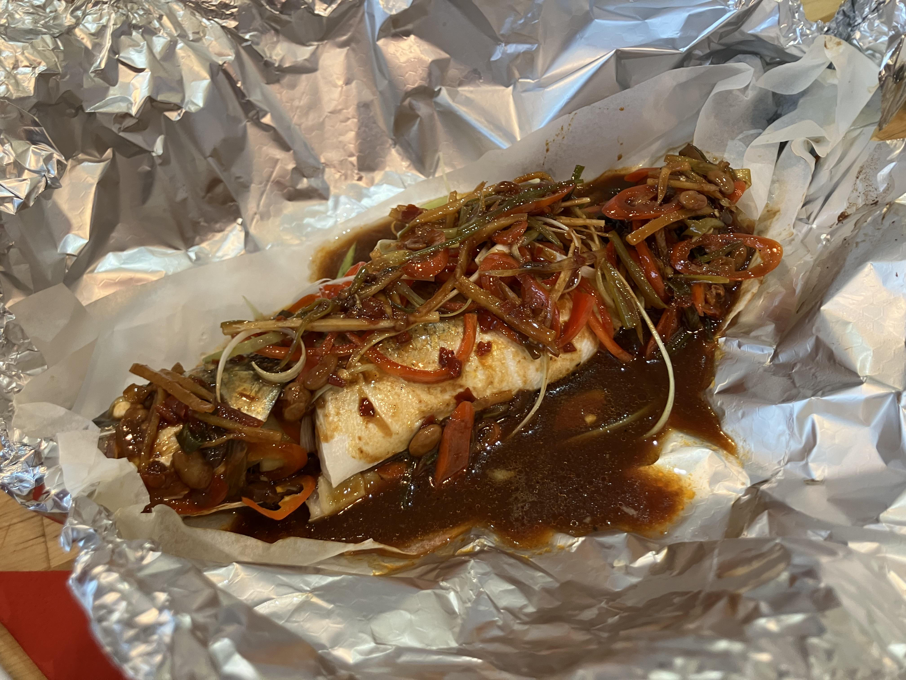

+++
date = '2026-01-19T20:36:54Z'
draft = false
title = 'Sichuan Steamed Fish'
+++
Indicative macros: 355 calories 43g protein 20g fat for 2x 85g sea bass fillets from Tesco

I learnt the original version of this dish on a week long cooking course at the School of Wok in Covent Garden, London. It was already very healthy, with the only fat apart from what’s in the fish coming from some oil used to fry off the sauce ingredients. I tested the sauce without using oil and it works well. I’ve also tested using sea bass fillets, in case you can’t get a whole sea bass or don’t want to go through the rigmarole of scaling, gutting, and de-finning one.

## Ingredients

1x whole seabass (ask your fishmonger to scale, gut and remove all but the dorsal fin if you can)
OR
Either 4x sea bass fillets, scaled

Aromatics for garnish and sauce
4 spring onions
Red chilli
50g ginger

For the sauce \- per whole fish or two fillets
1 teaspoon Sichuan chilli bean paste e.g. Pinxiang
1 tsp dark soy sauce
1 tablespoon Shaoxing wine
1 tablespoon hoisin sauce
1 tablespoon of salted soybeans (Yes brand)

Baking / parchment paper
Tin foil

1. Preheat the oven to 180C (fan) or 200C (conventional).
2. Prep the aromatics for the garnish. Julienne all the spring onions into 2 inch long strips and set aside half for the sauce. Reserve the other half for stuffing in the fish.
3. Peel and halve the ginger. Take half for the sauce and julienne it, set aside for the sauce. Take the remainder and put with the spring onions for the fish stuffing.
4. Slice some thin slices of red chilli on a bias \- known as “horse ear” slices \- and put with the other fish stuffing ingredients.

Preparing your fish
1. If using a whole sea bass, thoroughly rinse the blood from the stomach cavity.
6. Pat the fillets or whole sea bass dry with kitchen roll.
7. Take a roughly 12 inch square of baking paper and place it on top of a similar size piece of tin foil.
8. If using a whole sea bass, place it in the centre of the paper/foil stack and place all the fish stuffing aromatics in the stomach cavity, evenly distributing them all the way along.
9. If using individual fillets, place 1 fillet skin side down, place it in the centre of the paper and foil stack and place half the fish stuffing aromatics on top. Then place another fillet skin side up on top. Repeat with another 12 inch square stack of baking paper and foil and the other 2 fillets.
10. Wrap up your bundles, tightly closing the foil at the top so no steam can escape.
11. Place on a baking tray in the oven for 15 minutes.
Tip: If you do use whole sea bass, I learnt on the course you can test the fish’s doneness by seeing if the dorsal fin comes out with no resistance when gently pulled.

While the fish cooks, make your sauce:
1. First mix for each whole fish or two fillets, 1 teaspoon Sichuan chilli bean paste e.g. Pinxiang; 1 tsp dark soy sauce, 1 tablespoon Shaoxing wine and 1 tablespoon hoisin sauce. 
14. Place 1 tablespoon of salted soybeans (Yes brand) in a small saucepan over a high heat.
15. Stir for about 30 seconds until the soybeans sizzle. Add the premixed sauce ingredients (red chilli bean paste, dark soy, Shaoxing wine and hoisin sauce) along with the aromatics \- ginger and spring onions.
16. Stir while heating until you can smell the ginger and spring onions.
17. Take a small amount from the sauce and taste it. If it is far too salty, thin with a few tablespoons of water, stir and bring back to the boil.
18. When the fish is ready, unwrap the foil parcel and pour over the sauce.
19. Serve with rice and suitable vegetables e.g. steamed pak choi, smashed cucumber salad.

